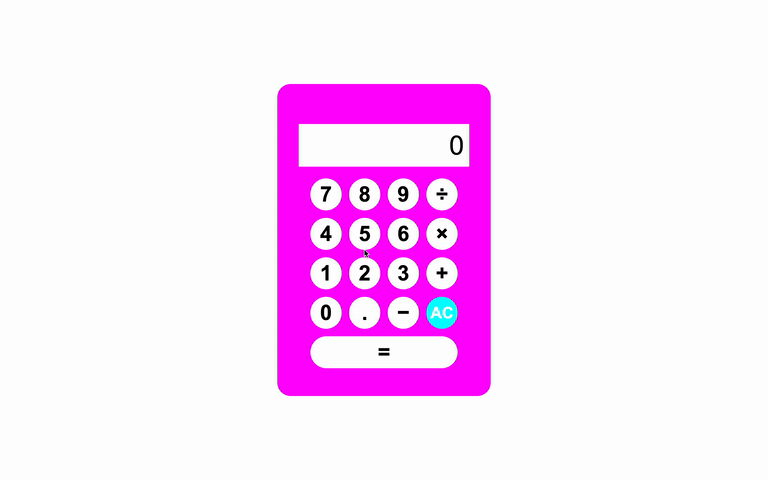

<h1 align="center">Simple OOP Calculator</h1>

A multi-function calculator using object oriented programming

 

 
<h2>How It's Made:</h2>

<strong>Tech Used:</strong> <em>HTML, CSS, JavaScript</em>

The calculator was created using OOP to reduce the repetiveness of adding code for each possible function of the calculator.

<h2>Optimizations</h2>

I changed the button functoning to include an all clear (AC) button to change the calculator display screen back to zero. 

<h2>Lessons Learned:</h2>

Start off small. It was important to remember this while attempting to add function such as addition, subtraction, and multiplicaton to my calculator. I had to decide what basic functons should my calculator absolutely have and then expand the use from there. 

